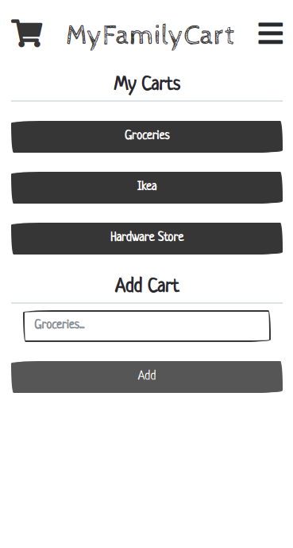
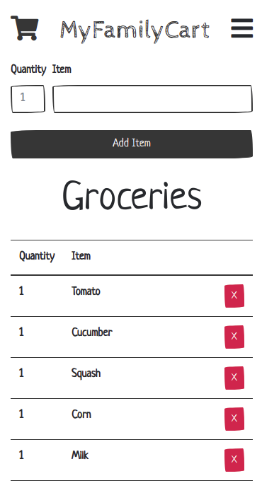

<!--
Todo: 
 * After signing up auto login
 * Account deletion
 * Fix the empty state, https://emptystat.es/
 * Does not work without JS: https://kryogenix.org/code/browser/everyonehasjs.html
 * Delete warning vs trash function (trashed boleen)
 * Can add the same item to a list twice, which does not update the quantity but instead just adds it again
 * Adding -1 shows an error
 * Adding the same item to a list twice, which does not update the quantity but instead just adds it again
 * Not sanitising HTML correctly when an item is initially inserted (although it is done correctly on page refresh; this is likely because you've got the add-an-item code twice, once in Django and once in Vue), so if I have HTML elements in the name of an item, they are rendered as HTML
 * no way to try the app without signing up
 * verify email ? 
-->

#  `Warning`
This site will reset March 14 @ 23:59 CET  
After the reboot the site will be permanent.  
  
In the meen time experiment and do what you want :).

## MyFamilyCart

Live at: https://myfamily.unialt.no (Responsive (Mobile Friendly))
  
### About

MyFamilyCart came to life as we / our tiny family needed a common
place to save our shopping lists. The App lets you create different
shopping carts (lists) where you can add and remove items.  
  
If you want to know more check out the [About Page](https://myfamily.unialt.no/about)

### Roadmap
Be aware that this app is in active development.

In order of expected implementation:

* Adding "Home Screen" icons (Android / iOS)
* Sharing of carts between users / familyname (shared accounts)
  * Removing the purpose of a familyname when users can share lists
* Self hosted version (Docker or Snap or both)
* Tests
* CI/CD Pipeline
* Alexa plugin
  * Even though this goes against all my principles the first thing my friend 
  asked was if he could add items via alexa...
* Greater separation between the Desktop site and Mobile Site

### Contribute
This projects main platform / framework is [Django](https://www.djangoproject.com/) 
with a bit of plain JavaScript (ES6) and a sprinkle of [Vue.js](https://vuejs.org/) along with 
[Bootstrap 4](https://getbootstrap.com/).  
  
If you are familiar with Django just clone the repo and have at it. `manage.py` has been 
altered to run `settings.dev` configuration with a SQLite database.  
  
Feel free to use this code for education / courses / tutorials and or what ever you want. 
If you see something wrong or se a better solution for anything I would appreciate if you 
create an issue so we (especially me) can evolve and benefit from your input.  
  
No issue is to small, I want your input/ideas.

*Notabene: Please do not make pull requests directly to the master branch.  
Any suggestions (packing) that makes the code less readable will be rejected as it 
goes against the purpose of the project which is for everyone to learn / be able
to read the code.*

**Functionality**

Utilizing Django to handle users / auth / login / backend tasks while JS onePage
apps take advantage of "normal" views as JS endpoints. 

**Basic Overview**

* /templates/base.html
  * FontAwsome
  * Bootstrap 4 <-- Theme / JS
  * /static/js/VueNavbar.js <-- Vue component
  * /static/js/global.js <-- Global JS functions
  
 * /cart/templates/cart/cart-list.html
   * Carts overview
   * /cart/static/cart/js/cart-list.js <-- One page app
  
* /cart/templates/cart/cart-detail.html
   * Cart Items
   * /cart/static/cart/js/cart-detail.js <-- One page app
   
* /users <-- User functionality

**Django Models / Database Tables**  
  

  

