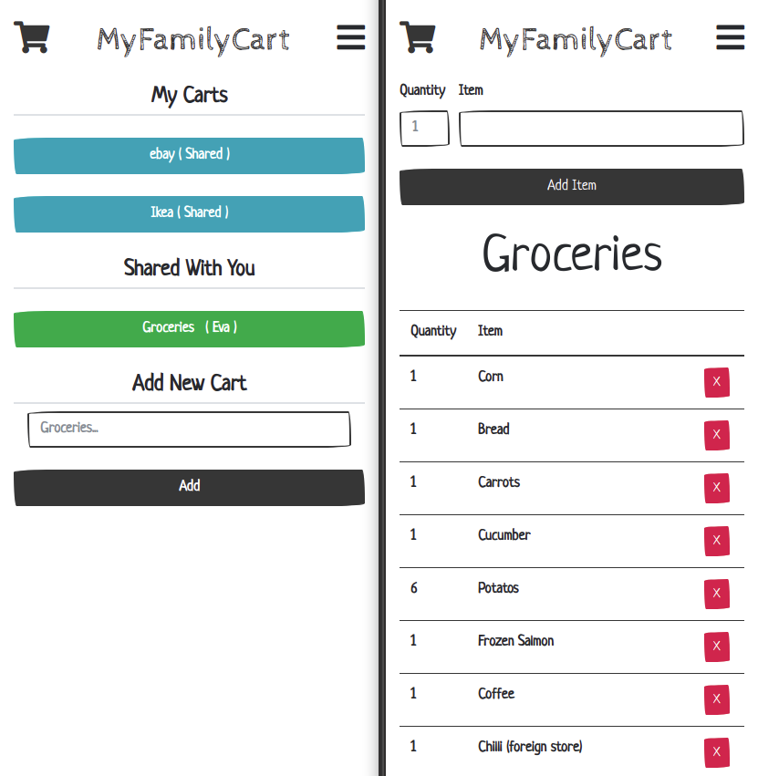
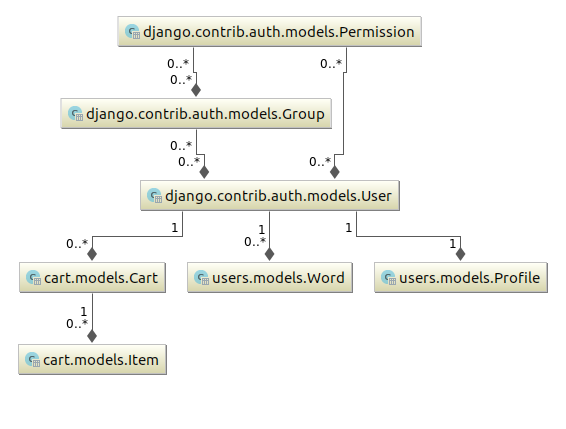

<!--
Todo: 

Make Carts easier to spot / Color?
remove or arrows

 * IMPLEMENT YARN, get rid of CDNs!!!
 * Tests
 * remove all CDN
 * CI/CD Pipeline
 * After signing up auto login
 * Fix the empty state, https://emptystat.es/
 * Does not work without JS: https://kryogenix.org/code/browser/everyonehasjs.html
 * Delete warning vs trash function (trashed boleen)
 * Can add the same item to a list twice, does not update the quantity but instead just adds it again
 * Adding -1 shows an error
 * no way to try the app without signing up
-->

## MyFamilyCart

Live at: https://myfamily.unialt.no (Responsive (Mobile Friendly))
  
### About

MyFamilyCart came to life as our family needed a common
place to save and share our shopping lists. The App lets you create different
shopping carts (lists) where you can add and remove items.  

Key features:
 * Shopping lists
 * Share lists with other users
  
If you want to know more check out the [About Page](https://myfamily.unialt.no/about)

### Roadmap

The app is working well and we ended up using it more than I thought so the plan
is to *re-write the app in Node.js with GraphQL, socket.io and Vue.js.*

This will make a more responsive app with more realtime features and allow for realtime
edits of items and more. Please add issues for wishes.

Planned features:

* Click editing of items
* Items can be "clickable" (links)
* Predictions will be cart related (Apple will not be suggested in IKEA cart)
* Todolist with reccuring tasks
* *maybe: Full blown callender function*

The work has started and I will add a link to the repo as soon as the foundation is made.

### Contribute
As I mentioned above, work on a new platform has started. But you are welcome to correct bugs
and contribute ideas.

This projects main platform / framework is [Django](https://www.djangoproject.com/) 
with a bit of plain JavaScript (ES6) and a sprinkle of [Vue.js](https://vuejs.org/) along with 
[Bootstrap 4](https://getbootstrap.com/).  
  
If you are familiar with Django just clone the repo and have at it. `manage.py` has been 
altered to run `settings.dev` configuration with a SQLite database.  
  
Feel free to use this code for education / courses / tutorials and or what ever you want. 
If you see something wrong or se a better solution for anything I would appreciate if you 
create an issue so we (especially me) can evolve and benefit from your input.  
  
No issue is to small, I want your input/ideas.

*Notabene: Please do not make pull requests directly to the master branch.  
Any suggestions (packing) that makes the code less readable will be rejected as it 
goes against the purpose of the project which is for everyone to learn / be able
to read the code.*

**Functionality**

Utilizing Django to handle users / auth / login / backend tasks while JS onePage
apps take advantage of "normal" views as JS endpoints. 

**Very Basic Overview**

* /templates/base.html
  * FontAwsome
  * Bootstrap 4 <-- Theme / JS
  * /static/js/VueNavbar.js <-- Vue component
  * /static/js/global.js <-- Global JS functions
  
 * /cart/templates/cart/cart-list.html
   * Carts overview
   * /cart/static/cart/js/cart-list.js <-- One page app
  
* /cart/templates/cart/cart-detail.html
   * Cart Items
   * /cart/static/cart/js/cart-detail.js <-- One page app
   
* /users <-- User functionality

**Django Models / Database Tables**  
  

  

